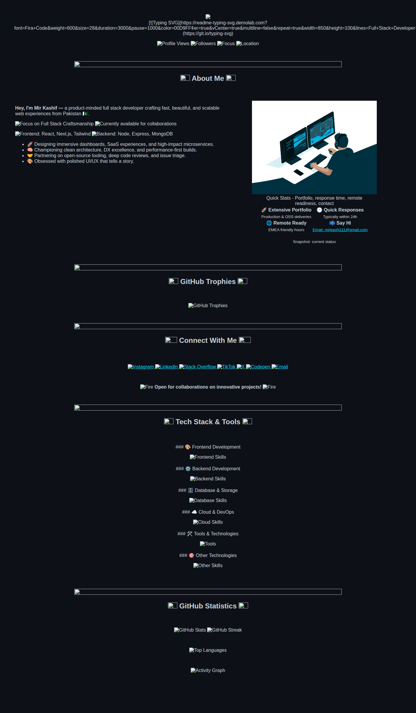

  

  
  
  
   
  
  

    
    
    
    
  

  

 

  

<h2 align="center">
  
  About Me
  
</h2>

 

  

<table>
  <tr>
    <td width="55%" valign="top" align="left">
      
      
<b>Hey, I'm Mir Kashif —</b> a product-minded full stack developer crafting fast, beautiful, and scalable web experiences from Pakistan 🇵🇰.

      

        
        
      

      

        
        
      

      <ul>
        <li>🚀 Designing immersive dashboards, SaaS experiences, and high-impact microservices.</li>
        <li>🧠 Championing clean architecture, DX excellence, and performance-first builds.</li>
        <li>🤝 Partnering on open-source tooling, deep code reviews, and issue triage.</li>
        <li>🎨 Obsessed with polished UI/UX that tells a story.</li>
      </ul>

    </td>
    <td width="45%" valign="top" align="center">
      <table>
        <tr>
          <td align="center" width="50%">
            
          </td>
          <td align="center" width="50%">
            
          </td>
        </tr>
      </table>
      <table>
        <caption>Professional availability and contact information</caption>
        <tr>
          <td align="center">
            <b>🚀 Extensive Portfolio</b> Production & OSS deliveries
          </td>
          <td align="center">
            <b>🕒 Quick Responses</b> Typically within 24h
          </td>
        </tr>
        <tr>
          <td align="center">
            <b>🌐 Remote Ready</b> EMEA friendly hours
          </td>
          <td align="center">
            <b>📫 Say Hi</b> <a href="mailto:mirkashi111@gmail.com">Email: mirkashi111@gmail.com</a>
          </td>
        </tr>
      </table>
    </td>
  </tr>
</table>

 

  

<h2 align="center">
  
  GitHub Trophies
  
</h2>

 

  
  <picture>
    <source media="(prefers-color-scheme: dark)" srcset="https://github-profile-trophy.vercel.app/api?username=mirkashi&theme=tokyonight&no-frame=true&column=4&rank=SECRET,SSS,SS,S,AAA,AA,A" />
    <source media="(prefers-color-scheme: light)" srcset="https://github-profile-trophy.vercel.app/api?username=mirkashi&theme=flat&no-frame=true&column=4&rank=SECRET,SSS,SS,S,AAA,AA,A" />
    
  </picture>

 

  

<h2 align="center">
  
  Connect With Me
  
</h2>

 

  
  
  
  
  
  
  

 

  
  <b>Open for collaborations on innovative projects!</b>
  

 

  

<h2 align="center">
  
  Tech Stack & Tools
  
</h2>

 

<table>
<tr>
<td align="center" width="100%">

### 🎨 Frontend Development

  

</td>
</tr>
<tr>
<td align="center" width="100%">

### ⚙️ Backend Development

  

</td>
</tr>
<tr>
<td align="center" width="100%">

### 🗄️ Database & Storage

  

</td>
</tr>
<tr>
<td align="center" width="100%">

### ☁️ Cloud & DevOps

  

</td>
</tr>
<tr>
<td align="center" width="100%">

### 🛠️ Tools & Technologies

  

</td>
</tr>
<tr>
<td align="center" width="100%">

### 🎯 Other Technologies

  

</td>
</tr>
</table>

 

  

<h2 align="center">
  
  GitHub Statistics
  
</h2>

 

  <picture>
    <source media="(prefers-color-scheme: dark)" srcset="https://github-readme-stats.vercel.app/api?username=mirkashi&show_icons=true&theme=tokyonight&hide_border=true&bg_color=0D1117&title_color=00D9FF&icon_color=00D9FF&text_color=c9d1d9&count_private=true&include_all_commits=true" />
    <source media="(prefers-color-scheme: light)" srcset="https://github-readme-stats.vercel.app/api?username=mirkashi&show_icons=true&theme=default&hide_border=true&count_private=true&include_all_commits=true" />
    
  </picture>
  <picture>
    <source media="(prefers-color-scheme: dark)" srcset="https://streak-stats.demolab.com/?user=mirkashi&theme=tokyonight&hide_border=true&background=0D1117&ring=00D9FF&fire=00D9FF&currStreakLabel=00D9FF" />
    <source media="(prefers-color-scheme: light)" srcset="https://streak-stats.demolab.com/?user=mirkashi&theme=default&hide_border=true" />
    
  </picture>

 

  <picture>
    <source media="(prefers-color-scheme: dark)" srcset="https://github-readme-stats.vercel.app/api/top-langs/?username=mirkashi&theme=tokyonight&hide_border=true&bg_color=0D1117&title_color=00D9FF&text_color=c9d1d9&layout=compact&langs_count=8&card_width=800" />
    <source media="(prefers-color-scheme: light)" srcset="https://github-readme-stats.vercel.app/api/top-langs/?username=mirkashi&theme=default&hide_border=true&layout=compact&langs_count=8&card_width=800" />
    
  </picture>

 

  <picture>
    <source media="(prefers-color-scheme: dark)" srcset="https://github-readme-activity-graph.vercel.app/graph?username=mirkashi&theme=react-dark&hide_border=true&area=true" />
    <source media="(prefers-color-scheme: light)" srcset="https://github-readme-activity-graph.vercel.app/graph?username=mirkashi&theme=github-light&hide_border=true&area=true" />
    
  </picture>

 

  

<h2 align="center">
  
  Contribution Activity
  
</h2>

 

  
<picture>
  <source media="(prefers-color-scheme: dark)" srcset="https://github-contributor-stats.vercel.app/api?username=mirkashi&limit=5&theme=tokyonight&combine_all_yearly_contributions=true&hide_border=true&bg_color=0D1117&title_color=00D9FF&text_color=c9d1d9" />
  <source media="(prefers-color-scheme: light)" srcset="https://github-contributor-stats.vercel.app/api?username=mirkashi&limit=5&theme=default&combine_all_yearly_contributions=true&hide_border=true" />
  
</picture>

 

  

<h2 align="center">
  
  Contribution Snake
  
</h2>

 

  <picture>
    <source media="(prefers-color-scheme: dark)" srcset="https://raw.githubusercontent.com/mirkashi/mirkashi/output/github-contribution-grid-snake-dark.svg">
    <source media="(prefers-color-scheme: light)" srcset="https://raw.githubusercontent.com/mirkashi/mirkashi/output/github-contribution-grid-snake.svg">
    
  </picture>

 

  

<h2 align="center">
  
  Let's Connect & Collaborate!
  
</h2>

 

<table>
  <tr>
    <td align="center" width="33%">
      
        
      <b>💼 Open for Collaborations</b>
       
      Innovative web projects & open-source contributions
    </td>
    <td align="center" width="33%">
      
        
      <b>📧 Email Me</b>
       
      <a href="mailto:mirkashi111@gmail.com">mirkashi111@gmail.com</a>
    </td>
    <td align="center" width="33%">
      
        
      <b>🌐 Portfolio</b>
       
      <a href="https://looplord.netlify.app/">Visit My Website</a>
    </td>
  </tr>
</table>

 

 

  

---

  

  

 

  <b>Made with 💖 and lots of ☕ by <a href="https://looplord.netlify.app/">Mir Kashif</a></b>

 

  

<!-- Proudly created with GPRM ( https://gprm.itsvg.in ) -->
