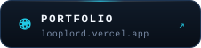
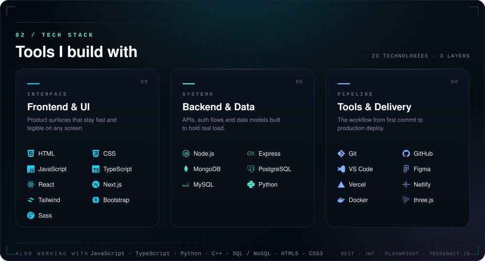
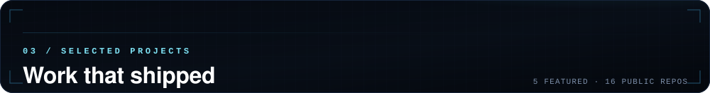
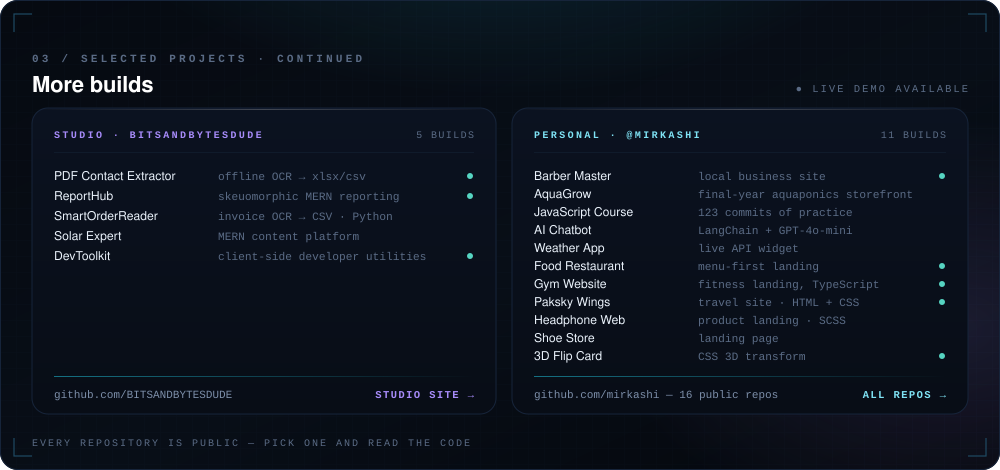
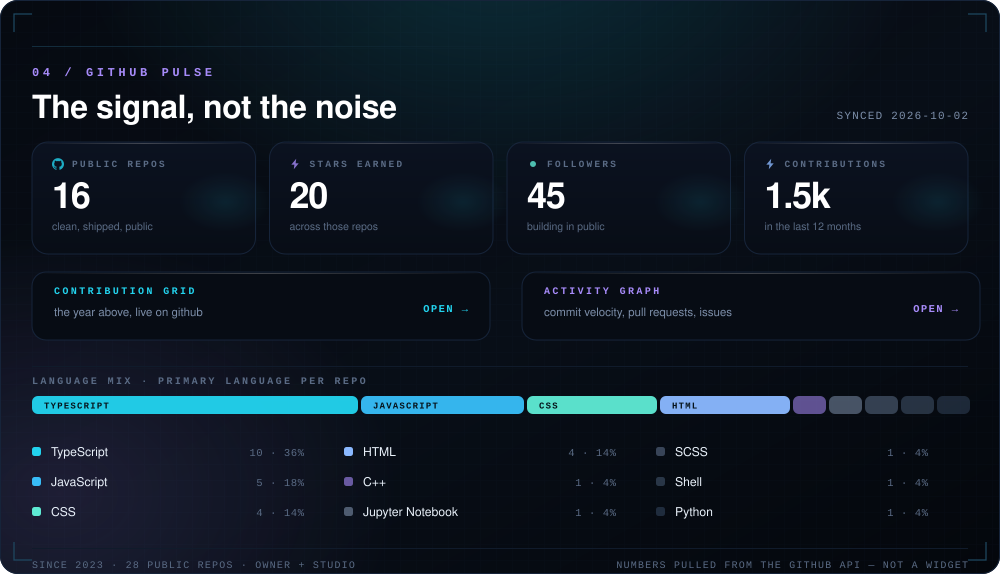
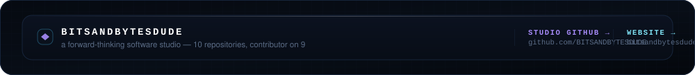

<!-- ── HERO ─────────────────────────────────────────────────────────────── -->


 

<!-- CTA buttons: real SVG pills, each one a link -->
<a href="https://looplord.vercel.app/"></a>
&nbsp;

&nbsp;

&nbsp;

 

<b>Full-stack developer</b> · Islamabad, Pakistan · <a href="#-studio--bitsandbytesdude">studio work</a> · <a href="#-github-pulse">github pulse</a> · <a href="#-reach-me">contact</a>

---

<!-- ── 01 · ABOUT ───────────────────────────────────────────────────────── -->



---

<!-- ── 02 · STACK ───────────────────────────────────────────────────────── -->



---

<!-- ── 03 · SELECTED PROJECTS ───────────────────────────────────────────── -->



<a href="https://looplord.vercel.app/"></a>

<a href="https://smart-profits-ruddy.vercel.app"></a>

<a href="https://sitepulse-rho.vercel.app"></a>

<a href="https://github.com/BITSANDBYTESDUDE/ActionDoc-AI"></a>

<a href="https://github.com/BITSANDBYTESDUDE/9T-Angle-Management"></a>



---

<!-- ── 04 · CONTRIBUTION GRID ───────────────────────────────────────────── -->



---

<!-- ── 05 · GITHUB PULSE ────────────────────────────────────────────────── -->



---

<!-- ── STUDIO ───────────────────────────────────────────────────────────── -->

<a href="https://github.com/BITSANDBYTESDUDE"></a>

---

<!-- ── 06 · REACH ME ────────────────────────────────────────────────────── -->



<a href="https://github.com/mirkashi"><b>GitHub</b></a> &nbsp;·&nbsp;
<a href="https://www.linkedin.com/in/mir-kashif-28987428b"><b>LinkedIn</b></a> &nbsp;·&nbsp;
<a href="https://looplord.vercel.app/"><b>Portfolio</b></a> &nbsp;·&nbsp;
<a href="mailto:mirkashi111@gmail.com"><b>Email</b></a> &nbsp;·&nbsp;
<a href="https://x.com/LoopLord10"><b>X / Twitter</b></a>

  

The flat version you're reading ships with a 3D one — a WebGL hero, tilt-reactive project cards and a live terminal →
<a href="profile-site/index.html"><b>profile-site/index.html</b></a>

  

<b>Build. Learn. Grow.</b> — same person, bigger dreams.

 

<a href="#top">back to top ↑</a>

  

Artwork is generated from source, not a badge service — see <a href="tools/readme-art">tools/readme-art</a>. Figures refreshed from the GitHub API on 2026-10-02.

